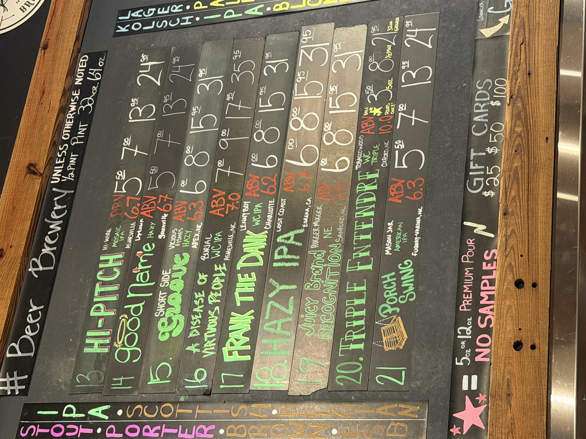

# Beerview

Photograph a beer menu, let Claude read it, store everything in Postgres, browse it on a local webpage. Uses multimodal LLM inference to extract structured data directly from images.

Brewpubs typically spend hours each week manually transcribing tap lists into spreadsheets, websites, or digital display systems — and those records go stale the moment a keg kicks. Beerview eliminates that overhead: a staff member snaps a photo of the chalkboard and the full list is digitized, structured, and searchable in seconds. The resulting database — tap number, beer name, brewery with website, style, ABV, and prices by pour size — can feed a venue's website, inform staff training, or serve as a running archive of everything that's ever poured. For multi-location operators, a single shared instance gives a real-time view across all tap rooms without manual data entry at any of them.



## How it works

1. Upload a photo of a tap list (chalkboard, printed menu, etc.) via the web UI or CLI
2. Claude's vision API extracts tap number, beer name, brewery (with website), style, ABV, and prices per pour size
3. Data lands in a local PostgreSQL database
4. A Flask app displays the full list as a card grid — brewery names link directly to the brewery's website where known

## Setup

**Requirements:** Python 3.10+, PostgreSQL

```bash
# 1. Install dependencies
pip install -r requirements.txt

# 2. Create the database
createdb beerview

# 3. Configure environment
cp .env.example .env
# Edit .env and set your ANTHROPIC_API_KEY
```

## Run the web app

```bash
python app.py
# open http://localhost:5000
```

Use the upload form to add a menu photo. Optionally enter the brew pub name — it's saved alongside every beer extracted from that image.

## Database schema

| Table | Key columns |
|-------|-------------|
| `uploads` | `id`, `brewpub`, `uploaded_at` |
| `beers` | `tap_number`, `name`, `brewery`, `brewery_url`, `brewpub`, `style`, `abv`, `created_at` |
| `beer_prices` | `beer_id`, `size_oz`, `price` |

`brewpub` is the venue name you enter at upload time. `brewery` is what Claude reads from the menu image; `brewery_url` is the brewery's official website as inferred by Claude from its knowledge. The schema is created (and migrated) automatically on app startup.

## Environment variables

| Variable | Description |
|----------|-------------|
| `ANTHROPIC_API_KEY` | Required. Get one at console.anthropic.com |
| `DATABASE_URL` | Postgres connection string (default: `postgresql://localhost/beerview`) |
| `SECRET_KEY` | Flask session secret (change in production) |
